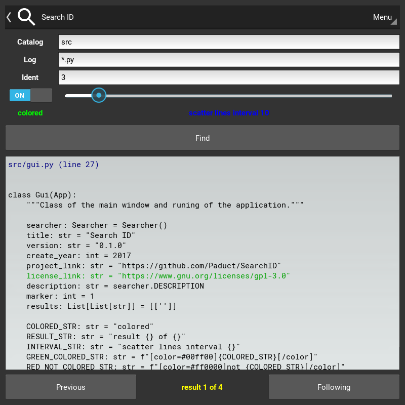

# Search ID
Search id in logs

## Requirements
- Python >= 3.6
- Kivy >= 1.10
- [Widgets KV](https://github.com/Paduct/widgets_kv)

## Installation
```shell
git clone https://github.com/Paduct/search_id
```

## Usage
### with GUI
```shell
python search_id
```
### from TUI
```shell
python search_id/src/searcher.py -c search_id/src _*_.py 800
```
```
usage: searcher.py [-h] [-c] [-i [I]] catalog log ident

positional arguments:
  catalog     directory to search
  log         file mask
  ident       required number

optional arguments:
  -h, --help  show this help message and exit
  -c          turn color design
  -i [I]      scatter of lines
```

## Screenshot

